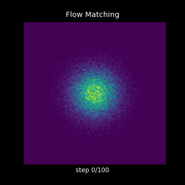
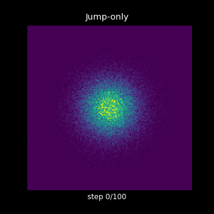
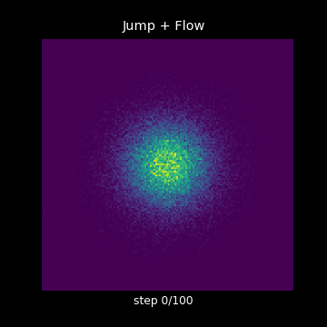
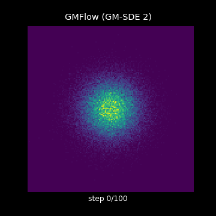
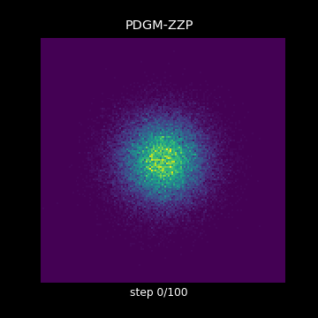

<div align="center">

# jump-models

**Generative models beyond standard diffusion — implemented and compared on a unified 2D toy benchmark**

</div>

This repository extends Meta's [`flow_matching`](https://github.com/facebookresearch/flow_matching) library with from-scratch reproductions of **four recent generative paradigms** that move beyond Gaussian-noise diffusion, all on the same 2D checkerboard so you can directly see how they differ.

| | | | | |
|:---:|:---:|:---:|:---:|:---:|
|  |  |  |  |  |
| **Flow Matching** (baseline) | **Jump-only** | **Jump + Flow** | **GMFlow** (GM-SDE 2) | **PDGM-ZZP** |

All five models share the **same MLP backbone** (4 hidden layers of width 512 + Swish), the same training budget (10k iters, batch 4096 on CondOT path / 2D checkerboard), and the same NFE = 100 backward sampler in the GIFs above. The only thing that changes between methods is **what kind of stochastic process generates the trajectory** and **what the network predicts**.

## Few-step sampling comparison

The whole point of these "non-Gaussian" formulations is that they can be **much more sample-efficient** at low NFE than vanilla flow matching. Here is the same comparison at NFE ∈ {2, 5, 10, 20, 50, 100}:


* **Flow Matching** needs ≥ 20 Euler steps before the checkerboard structure is recognisable.
* **Jump-only** and **Jump + Flow** already show 8 mode blobs at NFE = 2 because the per-step jump kernel is multimodal by construction.
* **GMFlow** is the most extreme case: with $K = 8$ mixture components, the analytic GM-SDE solver places one Gaussian on each checkerboard square in **a single step**.
* **PDGM-ZZP** trades off — the velocity space is just $\{-1, +1\}^d$ so it needs many flips to mix, but it does so without ever invoking Brownian noise.

## What's in here

| Module | What it implements | Reference |
|---|---|---|
| `flow_matching/path` & `flow_matching/solver` | Standard CondOT flow matching (upstream) | Lipman et al., ICLR 2023 |
| [`flow_matching/loss/jump_loss.py`](flow_matching/loss/jump_loss.py)<br>[`flow_matching/solver/jump_flow_solver.py`](flow_matching/solver/jump_flow_solver.py) | Jump kernel + Markov-superposition Euler sampler | Holderrieth et al., **Generator Matching**, ICLR 2025 ([arXiv 2410.20587](https://arxiv.org/abs/2410.20587)) |
| [`flow_matching/gmflow/`](flow_matching/gmflow/) | GM NLL loss, $u \to x_0$ reparameterisation, GM-SDE / GM-ODE 1st & 2nd-order solvers | Chen et al., **Gaussian Mixture Flow Matching**, ICML 2025 ([arXiv 2504.05304](https://arxiv.org/abs/2504.05304)) |
| [`flow_matching/pdmp/`](flow_matching/pdmp/) | Forward Zig-Zag simulator, implicit ratio-matching loss, DJD splitting backward solver | Bertazzi et al., **Piecewise Deterministic Generative Models**, NeurIPS 2024 ([arXiv 2407.19448](https://arxiv.org/abs/2407.19448)) |

The five end-to-end demo notebooks live in `examples/`:

| Notebook | Models compared |
|---|---|
| [examples/2d_flow_matching.ipynb](examples/2d_flow_matching.ipynb) | Flow Matching baseline (upstream) |
| [examples/2d_jump_flow_comparison.ipynb](examples/2d_jump_flow_comparison.ipynb) | Flow vs Jump-only vs Jump + Flow |
| [examples/2d_gmflow_vs_flow.ipynb](examples/2d_gmflow_vs_flow.ipynb) | Flow vs GMFlow (4 solver variants) |
| [examples/2d_pdgm_zzp_vs_flow.ipynb](examples/2d_pdgm_zzp_vs_flow.ipynb) | Flow vs PDGM-ZZP |

## How each method works in one paragraph

### 1. Flow Matching — Lipman et al., ICLR 2023

The simplest of the five, and the baseline against which everything else is compared. Defines a *deterministic* probability path $x_t = (1-t)\,x_0 + t\,x_1$ between noise $x_0 \sim \mathcal{N}(0, I)$ and data $x_1$. The network regresses the constant per-pair velocity $\mu_\theta(x_t, t) \approx \mathbb{E}[x_1 - x_0 \mid x_t]$ with an L2 loss. Sampling solves the ODE $\dot x = \mu_\theta(x, t)$. **No SDE, no Brownian motion** — the only randomness is in how noise/data pairs are coupled during training.

### 2. Jump-only — Generator Matching, Holderrieth et al., ICLR 2025

Uses the *same* CondOT probability path, but realises it with a **continuous-time Markov chain** instead of an ODE: at each time the particle has some rate $\lambda_t(x_t)$ to suddenly jump to a new location drawn from a categorical $J_t(x' \mid x_t)$ over discretised bins. The conditional jump kernel given the data target $z = x_1$ is analytic (paper Generator Matching, eqs. for $k_t$, $\lambda_z$, $J_z$); the network is trained with a Bregman divergence (continuous-time ELBO) between its predicted $Q_\theta = \lambda_\theta J_\theta$ and the conditional $Q_z$. See [`flow_matching/loss/jump_loss.py`](flow_matching/loss/jump_loss.py).

### 3. Jump + Flow — Generator Matching, Markov superposition

Same paper, key insight: any linear combination of valid generators is again valid. The network predicts **all three** of velocity, jump intensity, and jump distribution; the loss is $\mathcal{L}_\text{flow} + \mathcal{L}_\text{jump}$; sampling alternates a small Euler flow step $(1-\alpha) h u_\theta$ with a Bernoulli "do we jump" check at rate $\alpha h \lambda_\theta$. This combines the smoothness of flow inside a mode with the ability of jumps to teleport across modes. See [`flow_matching/solver/jump_flow_solver.py`](flow_matching/solver/jump_flow_solver.py).

### 4. GMFlow — Chen et al., ICML 2025

Same forward path as Flow Matching, but the network **outputs an entire Gaussian mixture distribution** over velocity instead of a single mean:
$$q_\theta(u \mid x_t) = \sum_{k=1}^K A_k\, \mathcal{N}(u; \mu_k, s^2 I)$$
This generalises vanilla flow ($K = 1$, fixed $s$ recovers L2 loss exactly). Trained with NLL — or, more stably, the *transition NLL* that pushes the velocity GM through the analytic reverse transition (paper eq. 9). Crucially, because the predicted distribution is a GM, the **reverse transition is itself an analytic GM**, so a single sampling step can already place mass on each mode of the data. K=8 GM-SDE produces a recognisable checkerboard at **NFE = 1**. See [`flow_matching/gmflow/`](flow_matching/gmflow/) — ported from the [official GMFlow code](https://github.com/Lakonik/GMFlow).

### 5. PDGM-ZZP — Bertazzi et al., NeurIPS 2024

The most exotic of the five. **Augments the state to $(x, v) \in \mathbb{R}^d \times \{-1, +1\}^d$**: $v$ is a binary "velocity" added to the position. The forward process is a **piecewise deterministic Markov process** (PDMP), specifically the Zig-Zag process: between events $\dot x = v$ (straight-line motion, no noise!), at random times the $i$-th velocity coordinate flips with rate $\lambda_i = (v_i x_i)_+ + \lambda_r$ — faster when the particle is moving outward. The remarkable theoretical fact is that the **time reversal of a ZZP is itself a ZZP**, with the only thing changed being a density-ratio multiplier on the rate. The network learns this density ratio with implicit ratio matching (Bertazzi et al. paper Appendix D.1, eq. 24). The whole formulation never needs Brownian motion. See [`flow_matching/pdmp/zzp.py`](flow_matching/pdmp/zzp.py).

## Side-by-side cheat sheet

| | State space | Forward process | Network output | Loss |
|---|---|---|---|---|
| **Flow Matching** | $\mathbb{R}^d$ | Deterministic interpolation $(1-t)x_0 + tx_1$ | Mean velocity $\mu_\theta \in \mathbb{R}^d$ | L2 |
| **Jump-only** | $\mathbb{R}^d$ | CondOT path realised as a CTMC | $(\lambda_\theta, J_\theta)$ — rate + categorical over bins | Bregman / continuous-time ELBO |
| **Jump + Flow** | $\mathbb{R}^d$ | Markov superposition of ODE + CTMC | $\mu_\theta, \lambda_\theta, J_\theta$ | $\mathcal{L}_\text{flow} + \mathcal{L}_\text{jump}$ |
| **GMFlow** | $\mathbb{R}^d$ | Same as Flow Matching | GM params $\{A_k, \mu_k, s\}$ over velocity | NLL (or transition NLL) |
| **PDGM-ZZP** | $\mathbb{R}^d \times \{-1,+1\}^d$ | PDMP: deterministic motion + discrete velocity flips | Per-coord density ratios $r_i = p(-v_i\mid x)/p(v_i\mid x)$ | Implicit ratio matching |

## Installation

Same as the upstream package:

```bash
git clone https://github.com/<user>/jump-models
cd jump-models
pip install -e .
```

PyTorch ≥ 2.1 with CUDA is recommended. The 2D toy notebooks all run end-to-end in under 5 minutes on a single consumer GPU.

## Citation

If you use the code from this fork, please cite the four underlying papers:

```bibtex
@inproceedings{lipman2023flow,
  title={Flow Matching for Generative Modeling},
  author={Lipman, Yaron and Chen, Ricky T. Q. and Ben-Hamu, Heli and Nickel, Maximilian and Le, Matt},
  booktitle={ICLR},
  year={2023}
}

@inproceedings{holderrieth2025generator,
  title={Generator Matching: Generative Modeling with Arbitrary Markov Processes},
  author={Holderrieth, Peter and others},
  booktitle={ICLR},
  year={2025},
  note={arXiv:2410.20587}
}

@inproceedings{chen2025gmflow,
  title={Gaussian Mixture Flow Matching Models},
  author={Chen, Hansheng and Zhang, Kai and Tan, Hao and Xu, Zexiang and Luan, Fujun and Guibas, Leonidas and Wetzstein, Gordon and Bi, Sai},
  booktitle={ICML},
  year={2025},
  note={arXiv:2504.05304}
}

@inproceedings{bertazzi2024pdgm,
  title={Piecewise Deterministic Generative Models},
  author={Bertazzi, Andrea and Shariatian, Dario and Simsekli, Umut and Moulines, Eric and Durmus, Alain},
  booktitle={NeurIPS},
  year={2024},
  note={arXiv:2407.19448}
}
```

## Acknowledgements

This repository is a fork of [`facebookresearch/flow_matching`](https://github.com/facebookresearch/flow_matching) (CC-BY-NC 4.0). All upstream credit goes to the original authors — the original README is preserved as [UPSTREAM_README.md](UPSTREAM_README.md). The GMFlow ops in [`flow_matching/gmflow/`](flow_matching/gmflow/) are ported from the [official GMFlow implementation](https://github.com/Lakonik/GMFlow) by Hansheng Chen. License remains CC-BY-NC 4.0.
