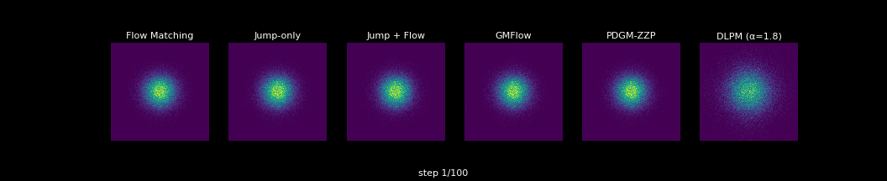
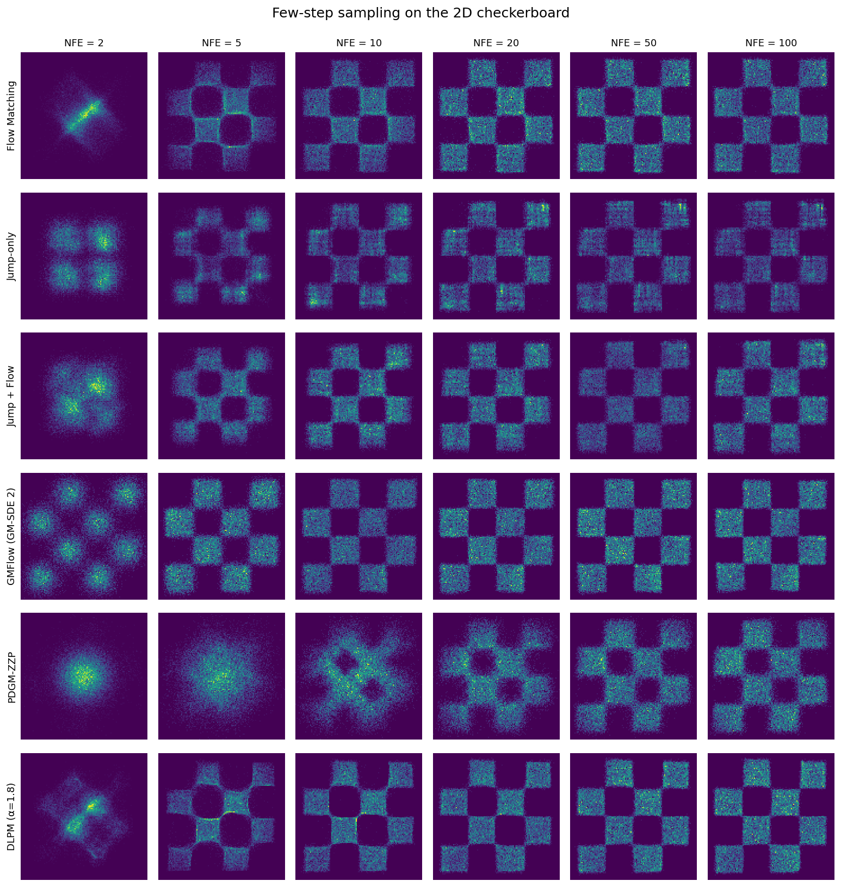
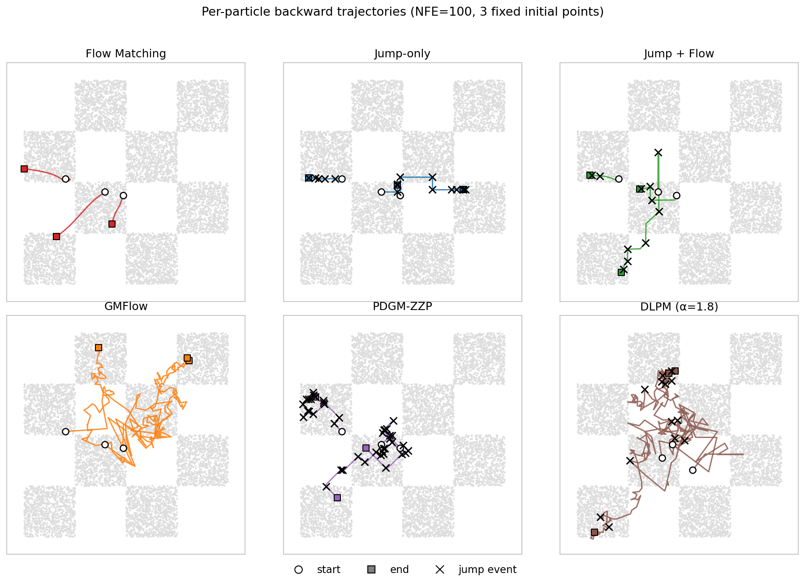

<div align="center">

# jump-models

**Jump Generative models on non-discrete state spaces — implemented and compared on a unified 2D toy benchmark**

</div>

This repository extends Meta's [`flow_matching`](https://github.com/facebookresearch/flow_matching) library with from-scratch reproductions of **six recent generative paradigms** that move beyond standard ODE-based / Gaussian-noise generation, all on the same 2D checkerboard so you can directly see how they differ.



All six models share the **same MLP backbone** (4 hidden layers of width 512 + Swish), the same training budget (10k iters, batch 4096 on the 2D checkerboard), and the same NFE = 100 backward sampler in the GIFs above. The only thing that changes between methods is **what kind of stochastic process generates the trajectory** and **what the network predicts**.

## Few-step sampling comparison

Comparison at NFE ∈ {2, 5, 10, 20, 50, 100}:



* **Flow Matching**, **Jump-only** and **Jump + Flow** jump+flow better than flow or jump.
* **GMFlow** is the most extreme case: with $K = 8$ mixture components, the analytic GM-SDE solver places one Gaussian on each checkerboard square in **a single step**.
* **PDGM-ZZP** trades off — the velocity space is just $\{-1, +1\}^d$ so it needs many flips to mix, its dynamics are more state-dependent than time-dependent, which may lead to better performance at larger NFE and provide greater potential for error correction.
* **DLPM** is the only method here that uses **non-Gaussian noise**: it replaces the Gaussian forward noise of DDPM with a heavier-tailed α-stable Lévy noise. You can see this directly in the GIF — the DLPM init frame is *visibly larger and more diffuse* than the tight Gaussian blob of every other method, with a clear heavy-tail halo. Those rare large noise draws are exactly the "Lévy jumps" the paper argues let DLPM reach isolated and rare modes. On a bounded toy like the checkerboard this hurts few-step quality (the heavy-tailed prior takes more steps to mix), but on **heavy-tailed or class-imbalanced data** the heavy-tailed prior is exactly what the paper shows you want.

## Per-particle backward trajectories

The full-distribution GIFs above hide *what an individual particle does* — but that's actually where the qualitative differences between these six methods are easiest to see. Below: 3 particles starting from the same fixed noise, traced backward at NFE = 100, with discrete-event markers (`x`) wherever a method has a notion of a "jump":



* **Flow Matching**: smooth ODE curves — by construction, deterministic and continuous. No jump events ever.
* **Jump-only**: each particle is *teleported* to a bin centre at every jump event; between jumps it sits still. The trajectory is a piecewise-constant zig-zag of horizontal/vertical hops.
* **Jump + Flow**: small Euler flow steps between rarer jump teleports — the smoothness of flow inside a mode plus jumps to switch modes.
* **GMFlow**: an SDE driven by Gaussian noise, so the trajectory is a continuous Brownian-like wiggle. No discrete jumps — every step is small.
* **PDGM-ZZP**: piecewise-deterministic constant-velocity motion punctuated by velocity-flip events; each `x` marker is a step where at least one $v_i$ flipped its sign. The trajectory is a sequence of straight-line segments.
* **DLPM (α = 1.8)**: heavy-tailed α-stable noise gives mostly Gaussian-like small steps but occasional anomalously large excursions — these are the "Lévy jumps". An `x` marker here is a step where the per-coord auxiliary $a_t$ exceeded a heavy-tail threshold (5.0, ≈ upper 5% of mass); equivalently, the step's noise amplitude $\sqrt{a_t}$ exceeded ≈ 1.6× the Gaussian baseline $\sqrt{2}$ — a magnitude a Gaussian sampler would essentially never produce.

The reproducible build script is at [`examples/build_trajectory_grid.py`](examples/build_trajectory_grid.py).

## What's in here

| Module | What it implements | Reference |
|---|---|---|
| `flow_matching/path` & `flow_matching/solver` | Standard CondOT flow matching (upstream) | Lipman et al., ICLR 2023 |
| [`flow_matching/loss/jump_loss.py`](flow_matching/loss/jump_loss.py)<br>[`flow_matching/solver/jump_flow_solver.py`](flow_matching/solver/jump_flow_solver.py) | Jump kernel + Markov-superposition Euler sampler | Holderrieth et al., **Generator Matching**, ICLR 2025 ([arXiv 2410.20587](https://arxiv.org/abs/2410.20587)) |
| [`flow_matching/gmflow/`](flow_matching/gmflow/) | GM NLL loss, $u \to x_0$ reparameterisation, GM-SDE / GM-ODE 1st & 2nd-order solvers | Chen et al., **Gaussian Mixture Flow Matching**, ICML 2025 ([arXiv 2504.05304](https://arxiv.org/abs/2504.05304)) |
| [`flow_matching/pdmp/`](flow_matching/pdmp/) | Forward Zig-Zag simulator, implicit ratio-matching loss, DJD splitting backward solver | Bertazzi et al., **Piecewise Deterministic Generative Models**, NeurIPS 2024 ([arXiv 2407.19448](https://arxiv.org/abs/2407.19448)) |
| [`flow_matching/dlpm/`](flow_matching/dlpm/) | Symmetric α-stable noise (Chambers-Mallows-Stuck), augmented (a, z) one-r.v. training loss elements, stochastic DLPM and deterministic DLIM samplers | Shariatian et al., **Denoising Lévy Probabilistic Models**, ICLR 2025 ([arXiv 2407.18609](https://arxiv.org/abs/2407.18609)) |

The five end-to-end demo notebooks live in `examples/`:

| Notebook | Models compared |
|---|---|
| [examples/2d_flow_matching.ipynb](examples/2d_flow_matching.ipynb) | Flow Matching baseline (upstream) |
| [examples/2d_jump_flow_comparison.ipynb](examples/2d_jump_flow_comparison.ipynb) | Flow vs Jump-only vs Jump + Flow |
| [examples/2d_gmflow_vs_flow.ipynb](examples/2d_gmflow_vs_flow.ipynb) | Flow vs GMFlow (4 solver variants) |
| [examples/2d_pdgm_zzp_vs_flow.ipynb](examples/2d_pdgm_zzp_vs_flow.ipynb) | Flow vs PDGM-ZZP |
| [examples/2d_dlpm_vs_flow.ipynb](examples/2d_dlpm_vs_flow.ipynb) | Flow vs DLPM (α=1.8) |

## How each method works in one paragraph

### 1. Flow Matching — Lipman et al., ICLR 2023

The simplest of the five, and the baseline against which everything else is compared. Defines a *deterministic* probability path $x_t = (1-t)\,x_0 + t\,x_1$ between noise $x_0 \sim \mathcal{N}(0, I)$ and data $x_1$. The network regresses the constant per-pair velocity $\mu_\theta(x_t, t) \approx \mathbb{E}[x_1 - x_0 \mid x_t]$ with an L2 loss. Sampling solves the ODE $\dot x = \mu_\theta(x, t)$. **No SDE, no Brownian motion** — the only randomness is in how noise/data pairs are coupled during training.

### 2. Jump-only — Generator Matching, Holderrieth et al., ICLR 2025

Uses the *same* CondOT probability path, but realises it with a **(Markov) jump process on $\mathbb{R}^d$** instead of an ODE: at each time the particle has some rate $\lambda_t(x_t)$ to suddenly jump to a new location drawn from a jump measure $J_t(x' \mid x_t)$ — in our 2D toy implementation we parameterise it as a categorical over discretised bin centres plus uniform within-bin jitter, so the state stays in $\mathbb{R}^2$. **This is *not* a CTMC**: in the Generator Matching Theorem 1 / Table 1 taxonomy, "CTMC" is reserved for finite discrete state spaces $|S| < \infty$ where the generator is a rate matrix; jump processes for $S = \mathbb{R}^d$ are a *separate* model class — the paper's contribution #2 specifically calls them "an unexplored model class for $\mathbb{R}^d$". The conditional jump kernel given the data target $z = x_1$ is analytic; the network is trained with a Bregman divergence (continuous-time ELBO) between its predicted $Q_\theta = \lambda_\theta J_\theta$ and the conditional $Q_z$. See [`flow_matching/loss/jump_loss.py`](flow_matching/loss/jump_loss.py).

### 3. Jump + Flow — Generator Matching, Markov superposition

Same paper, key insight: any linear combination of valid generators is again valid. The network predicts **all three** of velocity, jump intensity, and jump distribution; the loss is $\mathcal{L}_\text{flow} + \mathcal{L}_\text{jump}$; sampling alternates a small Euler flow step $(1-\alpha) h u_\theta$ with a Bernoulli "do we jump" check at rate $\alpha h \lambda_\theta$. This combines the smoothness of flow inside a mode with the ability of jumps to teleport across modes. See [`flow_matching/solver/jump_flow_solver.py`](flow_matching/solver/jump_flow_solver.py).

### 4. GMFlow — Chen et al., ICML 2025

Same forward path as Flow Matching, but the network **outputs an entire Gaussian mixture distribution** over velocity instead of a single mean:
$$q_\theta(u \mid x_t) = \sum_{k=1}^K A_k\, \mathcal{N}(u; \mu_k, s^2 I)$$
This generalises vanilla flow ($K = 1$, fixed $s$ recovers L2 loss exactly). Trained with NLL — or, more stably, the *transition NLL* that pushes the velocity GM through the analytic reverse transition (paper eq. 9). Crucially, because the predicted distribution is a GM, the **reverse transition is itself an analytic GM**, so a single sampling step can already place mass on each mode of the data. K=8 GM-SDE produces a recognisable checkerboard at **NFE = 1**. See [`flow_matching/gmflow/`](flow_matching/gmflow/) — ported from the [official GMFlow code](https://github.com/Lakonik/GMFlow).

### 6. DLPM — Shariatian et al., ICLR 2025

A *very* clean modification of DDPM: keep the entire DDPM machinery (cosine schedule, eps-prediction, ancestral sampling) but **replace the Gaussian noise with a symmetric α-stable Lévy noise**:
$$x_t = \bar\gamma_t\, x_0 + \bar\sigma_t\, \epsilon, \qquad \epsilon \sim S_\alpha S$$
For $\alpha = 2$ this is exactly DDPM; for $\alpha < 2$ the noise has heavy power-law tails. The paper shows this helps on heavy-tailed data and class-imbalanced datasets where the rare classes need rare noise samples to be reachable in the forward process. Note that under the paper's convention $S_\alpha(0,\,\sigma{=}1)\big|_{\alpha=2} = \mathcal{N}(0, 2)$ — wider than $\mathcal{N}(0, I)$ even at the Gaussian limit, and visibly heavier-tailed for $\alpha < 2$. That's why the DLPM init frame in the GIFs above is intentionally a bigger, more diffuse blob than every other method's $\mathcal{N}(0, I)$ prior — the heavy-tail halo is the design feature.

For $\alpha < 2$ the SaS distribution has *infinite variance* so a naive L2 loss on $\epsilon$ would have infinite expected gradient. The official code uses two tricks (and we follow them faithfully in [`flow_matching/dlpm/`](flow_matching/dlpm/)): (i) **augmented sampling** $\epsilon = \sqrt{a_t}\, z_t$ where $a_t$ is positive $\alpha/2$-stable and $z_t$ is Gaussian, so each individual training sample is bounded; and (ii) **L2-norm loss** $\sqrt{\frac{1}{d}\sum_i (\hat\epsilon_i - \epsilon_{t,i})^2}$ instead of L2-squared, which keeps the loss expectation finite for any $\alpha > 1$. See [`flow_matching/dlpm/dlpm.py`](flow_matching/dlpm/dlpm.py) — direct port of [the official `darioShar/DLPM`](https://github.com/darioShar/DLPM).

### 5. PDGM-ZZP — Bertazzi et al., NeurIPS 2024

The most exotic of the five. **Augments the state to $(x, v) \in \mathbb{R}^d \times \{-1, +1\}^d$**: $v$ is a binary "velocity" added to the position. The forward process is a **piecewise deterministic Markov process** (PDMP), specifically the Zig-Zag process: between events $\dot x = v$ (straight-line motion, no noise!), at random times the $i$-th velocity coordinate flips with rate $\lambda_i = (v_i x_i)_+ + \lambda_r$ — faster when the particle is moving outward. The remarkable theoretical fact is that the **time reversal of a ZZP is itself a ZZP**, with the only thing changed being a density-ratio multiplier on the rate. The network learns this density ratio with implicit ratio matching (Bertazzi et al. paper Appendix D.1, eq. 24). The whole formulation never needs Brownian motion. See [`flow_matching/pdmp/zzp.py`](flow_matching/pdmp/zzp.py).

## Side-by-side cheat sheet

| | State space | Forward process | Network output | Loss |
|---|---|---|---|---|
| **Flow Matching** | $\mathbb{R}^d$ | Deterministic interpolation $(1-t)x_0 + tx_1$ | Mean velocity $\mu_\theta \in \mathbb{R}^d$ | L2 |
| **Jump-only** | $\mathbb{R}^d$ | CondOT path realised as a Markov **jump process** on $\mathbb{R}^d$ (*not* a CTMC) | $(\lambda_\theta, J_\theta)$ — rate + categorical over bins | Bregman / continuous-time ELBO |
| **Jump + Flow** | $\mathbb{R}^d$ | Markov superposition of ODE + jump process | $\mu_\theta, \lambda_\theta, J_\theta$ | $\mathcal{L}_\text{flow} + \mathcal{L}_\text{jump}$ |
| **GMFlow** | $\mathbb{R}^d$ | Same as Flow Matching | GM params $\{A_k, \mu_k, s\}$ over velocity | NLL (or transition NLL) |
| **PDGM-ZZP** | $\mathbb{R}^d \times \{-1,+1\}^d$ | PDMP: deterministic motion + discrete velocity flips | Per-coord density ratios $r_i = p(-v_i\mid x)/p(v_i\mid x)$ | Implicit ratio matching |
| **DLPM** | $\mathbb{R}^d$ | DDPM with α-stable noise (cosine schedule) | SaS noise $\hat\epsilon$ in augmented form $\sqrt{a_t}\, z_t$ | L2-norm of eps prediction |

## Installation

Same as the upstream package:

```bash
git clone https://github.com/<user>/jump-models
cd jump-models
pip install -e .
```

PyTorch ≥ 2.1 with CUDA is recommended. The 2D toy notebooks all run end-to-end in under 5 minutes on a single consumer GPU.

## Citation

If you use the code from this fork, please cite the four underlying papers:

```bibtex
@inproceedings{lipman2023flow,
  title={Flow Matching for Generative Modeling},
  author={Lipman, Yaron and Chen, Ricky T. Q. and Ben-Hamu, Heli and Nickel, Maximilian and Le, Matt},
  booktitle={ICLR},
  year={2023}
}

@inproceedings{holderrieth2025generator,
  title={Generator Matching: Generative Modeling with Arbitrary Markov Processes},
  author={Holderrieth, Peter and others},
  booktitle={ICLR},
  year={2025},
  note={arXiv:2410.20587}
}

@inproceedings{chen2025gmflow,
  title={Gaussian Mixture Flow Matching Models},
  author={Chen, Hansheng and Zhang, Kai and Tan, Hao and Xu, Zexiang and Luan, Fujun and Guibas, Leonidas and Wetzstein, Gordon and Bi, Sai},
  booktitle={ICML},
  year={2025},
  note={arXiv:2504.05304}
}

@inproceedings{bertazzi2024pdgm,
  title={Piecewise Deterministic Generative Models},
  author={Bertazzi, Andrea and Shariatian, Dario and Simsekli, Umut and Moulines, Eric and Durmus, Alain},
  booktitle={NeurIPS},
  year={2024},
  note={arXiv:2407.19448}
}

@inproceedings{shariatian2025dlpm,
  title={Denoising L\'evy Probabilistic Models},
  author={Shariatian, Dario and Simsekli, Umut and Durmus, Alain},
  booktitle={ICLR},
  year={2025},
  note={arXiv:2407.18609}
}
```

## Acknowledgements

This repository is a fork of [`facebookresearch/flow_matching`](https://github.com/facebookresearch/flow_matching) (CC-BY-NC 4.0). All upstream credit goes to the original authors — the original README is preserved as [UPSTREAM_README.md](UPSTREAM_README.md). The GMFlow ops in [`flow_matching/gmflow/`](flow_matching/gmflow/) are ported from the [official GMFlow implementation](https://github.com/Lakonik/GMFlow) by Hansheng Chen. License remains CC-BY-NC 4.0.
